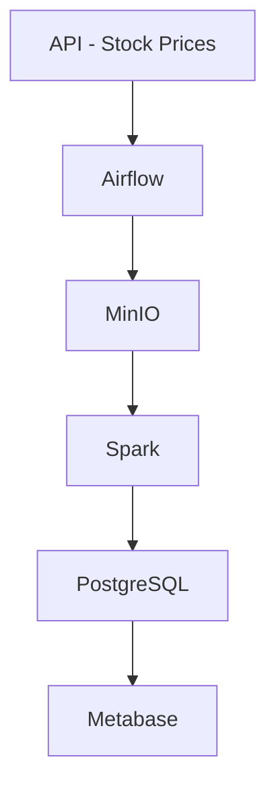

# 📈 Stock Market ETL with Apache Airflow

Este proyecto implementa un pipeline de tipo ETL (Extract, Transform, Load) usando **Apache Airflow** para obtener datos históricos del precio de acciones (NVDA), transformarlos con **Apache Spark**, y almacenarlos en una base de datos **PostgreSQL**. Los datos procesados luego son visualizados en un dashboard creado con **Metabase**.

## 🚀 Tecnologías utilizadas

- 🛠️ Python
- ⏱️ Apache Airflow
- 🐘 PostgreSQL
- 🐳 Docker / Docker Compose
- 🧠 Apache Spark (contenedor auto-destructivo)
- 🪣 MinIO (almacenamiento tipo S3)
- 📊 Metabase (dashboarding)
- 🌐 API de mercado de valores

## 🧩 Arquitectura del proyecto



## ⚙️ Funcionalidades

- Automatización de un flujo ETL con DAGs en Airflow
- Contenedor de Spark que se ejecuta y destruye automáticamente tras procesar los datos
- Transformaciones con Spark DataFrames
- Almacenamiento temporal con MinIO (tipo S3)
- Almacenamiento final en PostgreSQL
- Visualización de KPIs como el promedio de precios con Metabase

## 📁 Estructura del repositorio

```
├── dags/
│   └── stock_etl_dag.py        # DAG principal de Airflow
├── docker/
│   └── spark/
│       └── Dockerfile          # Imagen personalizada para Spark
├── scripts/
│   └── transform.py            # Script de Spark para transformación de datos
├── metabase/                   # Archivos de configuración opcional
├── docker-compose.yml          # Orquestación de servicios
├── requirements.txt            # Dependencias
└── README.md                   # Este archivo
```

## 🧪 Cómo ejecutar el proyecto localmente

```bash
# Clonar el repositorio
git clone https://github.com/Pulixe/Stock-Market-ETL_-ApacheAirflow
cd Stock-Market-ETL_-ApacheAirflow

# Levantar servicios
docker-compose up --build

# Accede a Airflow en:
http://localhost:8080

# Usuario: airflow
# Contraseña: airflow

# Accede a Metabase en:
http://localhost:3000
```

## 📊 Ejemplo del dashboard

El dashboard de Metabase incluye visualizaciones como:

- Promedio del precio de cierre
- Volumen de transacciones
- Gráficos de tendencias por día

## 📌 Lecciones aprendidas

- Orquestación efectiva de tareas con Airflow
- Uso de MinIO como sistema de archivos intermedio
- Contenerización de Spark para procesamiento por lotes
- Integración completa de un stack ETL moderno
- Mejora de mis habilidades en Python orientado a datos

## 🧠 Autor

**Francisco Pulice Rojas**  
🌐 [www.pulixe.info](http://www.pulixe.info)   
📂 [Otros repositorios](https://github.com/Pulixe)

---

Este proyecto fue desarrollado como parte del curso de Apache Airflow de Marc Lamberti en Udemy.

